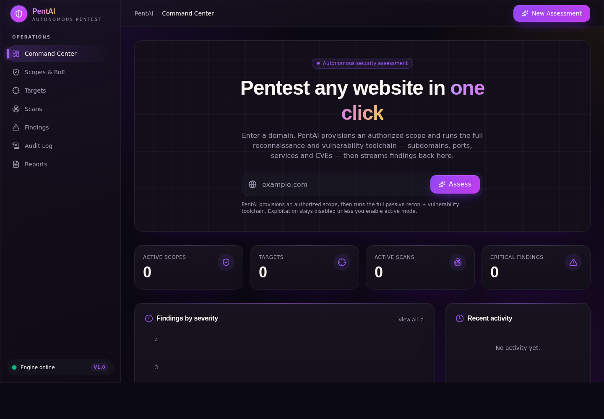
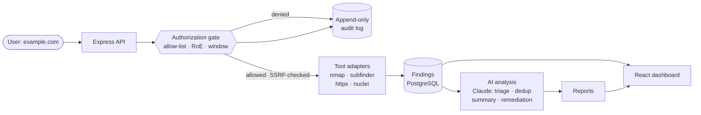

<div align="center">

# PentAI

### Autonomous, authorization-first web penetration testing

Enter a domain. PentAI provisions an authorized engagement scope and runs a full
reconnaissance and vulnerability toolchain — subdomains, ports, services and CVEs —
then streams the findings back into a premium security operations console.

[](https://www.typescriptlang.org/)
[](https://react.dev/)
[](https://nodejs.org/)
[](https://orm.drizzle.team/)
[](#license)



</div>

---

## Why PentAI

Real penetration testing is a sequence of specialised tools glued together by an
operator: enumerate subdomains, probe live services, fingerprint the stack, scan for
known CVEs, triage findings, and write it all up. PentAI turns that pipeline into a
**single action** — type a URL — while keeping the one thing that separates a security
tool from a liability: **you can only scan what you are authorized to scan.**

- **One-click assessments.** The Command Center takes a domain, provisions an authorized
  scope + allow-listed target, and dispatches the whole recon → vulnerability toolchain
  automatically. No YAML, no CLI flags.
- **Authorization-first by design.** Every scan passes through a single hard chokepoint
  that checks the allow-list, active rules-of-engagement, the engagement time window, and
  an explicit opt-in before any active/exploit tooling can run. Every allowed *and* denied
  attempt is written to an append-only audit log.
- **Real tools, not mock output.** Recon and scanning are executed by industry-standard
  tools (nmap, subfinder, httpx, nuclei), each isolated in a throwaway container.
- **AI analysis, not just raw output.** When an API key is configured, Claude turns raw
  findings into an executive + technical summary, re-ranks them by real-world **business
  risk**, **deduplicates** overlapping findings across tools, and writes concrete
  remediation — attached to every generated report.
- **Safe by default.** A hard SSRF / internal-target guard refuses loopback, RFC1918,
  link-local, and cloud-metadata (169.254.169.254) addresses; tool arguments never touch a
  shell. Covered by a unit-tested suite that runs in CI.
- **A console that looks the part.** A premium, glassmorphic dashboard with live scan
  status, severity analytics, findings with CVE references and remediation, and
  exportable engagement reports.

## How the one-click flow works

```
        example.com
             │
             ▼
   ┌───────────────────────┐
   │  Authorization gate    │  provision scope (RoE) + allow-listed target
   └───────────┬───────────┘
               ▼
   ┌───────────────────────┐   passive / safe-mode by default
   │  subfinder  → recon    │   subdomain enumeration
   │  httpx      → recon    │   HTTP fingerprinting
   │  nmap       → recon    │   port & service discovery
   │  nuclei     → scan     │   CVE / template matching
   └───────────┬───────────┘
               ▼
      findings · severity analytics · audit log · reports
```

Exploitation tooling stays **disabled** unless active mode is explicitly enabled on a
target — a deliberate safety boundary, not an oversight.

## Terminal tool (`pentai` CLI)

Prefer the command line? PentAI ships a standalone CLI that runs the same
scanning engine — no database or server required. The `dns`, `headers`, and
`tls` checks run in-process and produce real findings with **no Docker**;
Docker unlocks the container-based tools (`subfinder`, `httpx`, `nmap`,
`nuclei`) and is skipped gracefully when absent.

```bash
# Once published to npm:
npm install -g @kryptbakar/pentai           # or: npx @kryptbakar/pentai scan example.com

# From this repo (before publishing):
pnpm install
pnpm --filter @kryptbakar/pentai build
npm link ./artifacts/cli        # or: alias pentai="node $PWD/artifacts/cli/dist/pentai.mjs"

# Scan a site you're authorized to test
pentai scan example.com
pentai scan https://app.example.com --json report.json --md report.md
pentai scan example.com --tools subfinder,httpx,nuclei --yes
pentai list-tools
```

```
▶ subfinder running…
✓ subfinder — 3 finding(s)
▶ httpx running…
  [medium] Missing security headers on https://example.com
✓ httpx — 2 finding(s)
...
═══ Summary ═══
  high      1
  medium    4
  info      9
```

- **Safe by default** — passive recon + non-intrusive checks; `--active` opts in
  to active-mode tools. Loopback / private / cloud-metadata targets are refused.
- **Authorization prompt** — confirms before scanning; `--yes` for CI/non-interactive.
- **AI triage** — set `ANTHROPIC_API_KEY` to get an executive summary and
  business-risk ranking after the scan.
- **CI-friendly exit codes** — `0` clean, `2` when high/critical findings exist,
  `1` on error.

See [`artifacts/cli/README.md`](artifacts/cli/README.md) for full CLI docs.

## Architecture

PentAI is a contract-first TypeScript monorepo (pnpm workspaces).



| Layer | What it does | Tech |
| --- | --- | --- |
| **`artifacts/sentinel`** | Security operations dashboard | React 19, Vite 7, Tailwind v4, TanStack Query, Recharts, wouter |
| **`artifacts/api-server`** | REST API, authorization gate, tool orchestration | Express 5, Zod |
| **`api-server/src/adapters`** | Containerised tool runners (nmap, subfinder, httpx, nuclei) | Docker |
| **`api-server/src/services`** | Authorization gate, SSRF guard, AI analysis | Claude (`@anthropic-ai/sdk`) |
| **`lib/db`** | Schema: scopes, targets, scans, findings, audit, reports | PostgreSQL, Drizzle ORM |
| **`lib/api-spec`** | Single source of truth for every API contract | OpenAPI |
| **`lib/api-client-react` / `lib/api-zod`** | Generated React Query hooks + Zod validators | Orval codegen |

**Design principles**

- **Contract-first.** One OpenAPI spec generates both the server-side Zod validators and
  the client-side React Query hooks — types can never drift between front and back end.
- **Single chokepoint.** All scan triggers route through `authorizeTarget()`; the checks
  are never re-implemented per call site.
- **Append-only audit.** No `UPDATE`/`DELETE` on the audit log — the record of who ran
  what against which target is immutable.

## Tech stack

`TypeScript` · `React 19` · `Vite` · `Tailwind CSS v4` · `TanStack Query` · `Recharts` ·
`Express 5` · `Zod` · `PostgreSQL` · `Drizzle ORM` · `OpenAPI` + `Orval` · `Docker` ·
`pnpm workspaces`

## Getting started

**Prerequisites:** Node.js 24, pnpm, PostgreSQL, and Docker (for the tool adapters).

```bash
# 1. Install
pnpm install

# 2. Configure — copy the example and set DATABASE_URL
cp .env.example .env

# 3. Create the schema
pnpm --filter @workspace/db run push

# 4. Run the API (http://localhost:8080)
pnpm --filter @workspace/api-server run dev

# 5. Run the dashboard, in a second terminal
pnpm --filter @workspace/sentinel run dev
```

Then open the dashboard, drop a domain you own into the Command Center, and watch the
assessment run.

Useful workspace commands:

```bash
pnpm run typecheck   # full typecheck across every package
pnpm run build       # typecheck + build all packages
pnpm --filter @workspace/api-spec run codegen   # regenerate hooks & validators from OpenAPI
```

## Console modules

- **Command Center** — one-click assessment launcher, live stats, severity analytics,
  active scans, activity feed.
- **Scopes & RoE** — authorization scopes with signed rules-of-engagement and validity windows.
- **Targets** — host directory with allow-list and active-mode indicators.
- **Scans** — job management with the authorization gate enforced on creation.
- **Findings** — vulnerabilities with severity, CVE references, evidence and remediation.
- **Audit Log** — immutable record of every tool invocation, allowed or denied.
- **Reports** — exportable engagement reports generated from completed scans.

## Roadmap

- [x] AI-assisted triage, deduplication and natural-language finding summaries
- [x] SSRF / internal-target guard + unit tests + CI
- [x] Findings triage lifecycle + CVSS/CWE + AI business-risk ranking
- [x] Live scan progress streaming (SSE) to the dashboard
- [x] Domain-ownership verification (DNS TXT) for targets
- [x] Continuous monitoring: scheduled re-scans + findings diff over time
- [x] Shareable read-only report links
- [x] Outbound alerting (Slack/webhook) on new critical findings
- [x] Security-header analysis adapter
- [ ] Durable job workers (BullMQ/Redis) replacing in-process scan execution
- [ ] Additional adapters (sqlmap, ffuf, nikto, TLS/cert analysis) behind the gate
- [ ] Authentication, multi-tenant workspaces and role-based access
- [ ] PDF report export + OWASP/PCI compliance mappings
- [ ] Live hosted demo

## Responsible use

PentAI is built for testing systems **you own or are explicitly authorized to test**.
The authorization gate is a technical safeguard, not legal permission — always operate
within a signed engagement and applicable law.

## License

MIT
